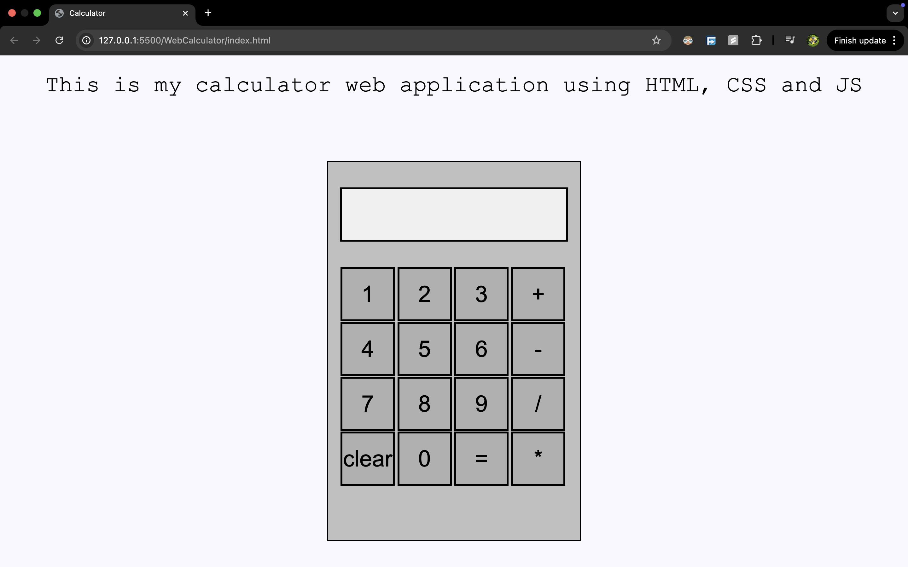

# Calculator Web App



Check it out here: [WebCalculator](web-calculator-9ayqqktzn-austin-fashs-projects.vercel.app)

A lightweight on-screen calculator built with plain HTML, CSS, and JavaScript.  
Enter a first number, pick an operator, enter a second number, then hit `=` to see the result.

## Features

- Addition, subtraction, multiplication and division
- Clear button resets everything
- Snarky error if you try to divide by zero
- Prevents accidental consecutive-operator presses
- Rounds long decimals to fit the display

## Usage

1. **Clone the repo**
   ```bash
   git clone https://github.com/AustinFash/WebCalculator.git
   ```
2. **Open the folder** in your editor of choice.
3. **Start Live Preview** (e.g. VS Code Live Server) on `index.html`.
4. **Click** the buttons to perform arithmetic operations.

Enjoy! 🎉
